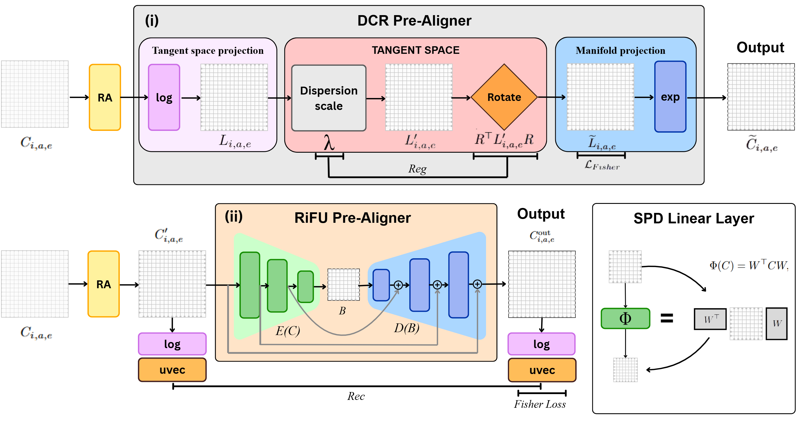
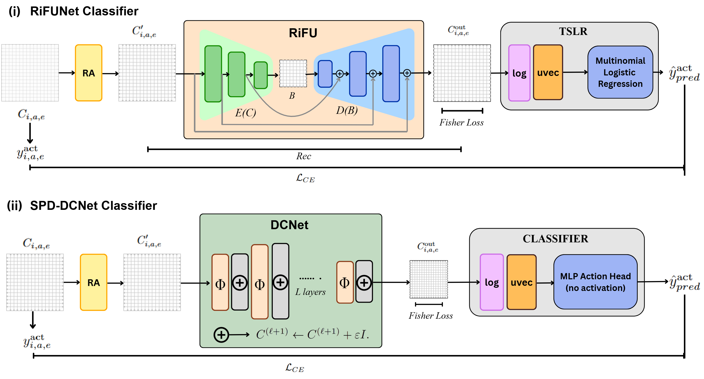

# EEG Research & GADCN

This repository contains research code and resources for EEG signal analysis, specifically focusing on Riemannian geometry-based approaches and Graph Attention Dual Convolution Networks (GADCN).

## 📄 Research Paper

The associated research paper can be found in the references folder:
- **Paper**: [arxiv_gadcn_icml_2026.pdf](references/arxiv_gadcn_icml_2026.pdf)

## 🏗️ Architecture

### Preprocessing Module


### Classifier Module


## 📂 Repository Structure

- **`models/Riemann/`**: Contains the core research code and models used for the publication.
- **`references/`**: Contains the research paper, diagrams, and other reference materials.
- **`preprocessing/`**: Modules for EEG data preprocessing.
- **`feature_extraction/`**: Tools for extracting features from EEG signals.
- **`data_construction/`**: Scripts for constructing datasets.
- **`EEG_data/`**: Directory for storing EEG datasets.
- **`train/`** & **`eval/`**: Scripts for training and evaluating models.

## 🚀 Installation

1. Clone the repository.
2. Install the required dependencies:

```bash
pip install -r requirements.txt
```

**Note**: For GPU support with PyTorch, ensure you have the appropriate CUDA version installed (CUDA 12.1 recommended).

## 🛠️ Usage

The `models/Riemann` directory contains the primary research implementations. Other directories like `preprocessing`, `feature_extraction`, and `data_construction` serve as dynamic utilities for the pipeline.

## 📚 Dependencies

Key dependencies include:
- `numpy`, `scipy`, `pandas`
- `mne`, `pyriemann`
- `torch`, `torchvision`, `torchaudio`
- `antropy`, `tsfel`

See `requirements.txt` for the full list.
